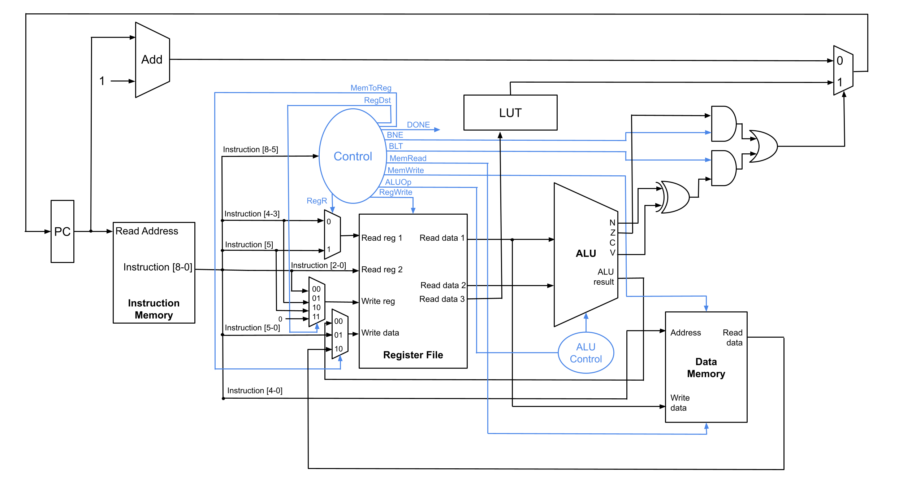

# HM Processor

A custom 9-bit load-store processor designed in SystemVerilog. The HM architecture was developed under a constrained instruction width while remaining capable of executing three floating-point benchmark programs.

---

## Design Philosophy

HM is a register-register (load-store) architecture inspired by MIPS and ARM while constrained to a 9-bit instruction format. The primary design goals were:

- Execute all three required benchmark programs efficiently
- Maximize hardware simplicity within a limited ISA
- Minimize software complexity whenever possible
- Support floating-point operations through software routines

---

## Architecture Overview

### Processor Characteristics

| Feature | Specification |
|----------|---------------|
| Instruction Width | 9 bits |
| Architecture | Register-register / Load-store |
| Registers | 8 General Purpose |
| Data Memory | 32 addresses |
| Branching | Exact-address LUT |
| Immediate Width | 6 bits |

### Architecture Diagram



---

## Instruction Set

| Type | Format | Instructions |
|------|--------|--------------|
| R | 1 bit type, 3 bits opcode, 2 bit source 
registers, 3 bit target register | ADD, AND, CMP, LSL, LSR, MOV, ORR, NOT |
| M | 2 bits type, 1 bit opcode, 1 bit reg, 5 bit 
memory address | LDR, STR |
| B | 3 bits type, 1 bit opcode, 5 bits register  | BNE, BLT |
| I | 3 bits type, 6 bits immediate | LDI |

---

## Software Implementation

Because the processor operates on only 8-bit values, all 16-bit arithmetic is implemented in software.

### Program 1
- Normalize integer
- Compute exponent
- Assemble floating-point representation

### Program 2
- Extract sign
- Recover mantissa
- Handle overflow
- Convert back to fixed point

### Program 3
- Compare exponents
- Align mantissas
- Add
- Normalize
- Store result

---

## Simulation

Instructions for selecting

- Machine code
- Memory initialization
- Program-specific LUT
- Done address

---

## Results

- Program 1:
- Program 2:
- Program 3:

---

## Repository Structure

```text
TopLevel.sv
ProgramCounter.sv
InstructionROM.sv
ControlUnit.sv
RegFile.sv
ALU.sv
DataMem.sv
Lut.sv
...
```
---

## Authors

Maddux Madayag
Yu-Han Lou
